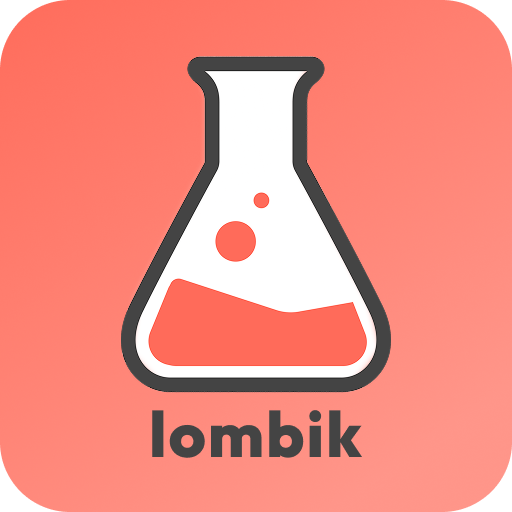

# Lombik

<div align="center">
  
</div>


## A practical Flask scaffold engine

Lombik is a practical scaffold engine for Flask that saves you from hours of configuration, integrations, boilerplate, and project-structure decisions.

It follows a **hypermedia-first approach**, leaning heavily on Flask, Jinja2, HTMX, Tailwind CSS, and server-rendered HTML. The idea is simple: keep as much application logic as possible close to the UI, without introducing a heavy frontend framework unless you actually need one.

As a real-world example, our commercial product **proov** — a digital delivery note / proof-of-delivery platform for logistics — is built with Lombik.

The application is roughly 20K lines of code, with HTML making up more than half of it:

```text
Language                     Files  Lines      Extension
--------------------------------------------------------
HTML                              58      11622   .html
Python                            87       7871   .py
JavaScript                         6        957   .js
Markdown                           6        281   .md
CSS                                1        276   .css
Text                               3        238   .txt
Shell Script                       1        146   .sh
JSON                               1         37   .json
XML                                1         22   .xml
TOML                               1          2   .toml
--------------------------------------------------------
TOTAL:                        165      21452
========================================================
```

The goal of Lombik is not to be the biggest Flask framework ever created.

It's to remove repetitive work and give you a clean starting point for building real applications.

---

## Getting started

### 1. Install Lombik

```bash
pip install lombik
```

I try to keep dependencies to a minimum.

Currently Lombik installs:

- Flask>=3.0
- Flask-SQLAlchemy>=3.1
- Flask-Migrate>=4.0
- Flask-Session>=0.6
- Flask-WTF>=1.2
- Flask-Caching>=2.3
- Flask-Limiter>=3.8
- SQLAlchemy>=2.0
- python-dotenv>=1.0
- pytest>=7.1.0
- pytest-cov>=7.1.0
- click>=8.1
- resend
- python-dateutil>=2.9.0

### 2. Create your application

Navigate to the folder where you want your application and run:

```bash
lombik createapp myapp
```

This generates the complete project structure for you.

Once created, you can run the application with:

```bash
lombik run
```

Before doing that, however, you'll probably want to initialize the database and create your first superuser.

### 3. Initialize the database

```bash
lombik initdb
```

By default, the development/test environment uses SQLite.

Production is configured to use MySQL by default, but you can change this in:

```text
lombik/configuration.py
```

Make sure your database credentials are configured in your environment variables.

### 4. Create a superuser

```bash
lombik superuser
```

Now run the application:

```bash
lombik run
```

And you're ready to go.

---

# Routes

Lombik keeps routing deliberately simple.

Let's say we want a page that only authenticated users can access.

At the top of your module:

```python
from lombik.wrappers import login_required
```

Then create the route:

```python
@core_bp.route("/members")
@login_required
def members():
    return render_template("...")
```

Simple.

Now let's make another route that only administrators and superusers can access.

```python
from lombik.wrappers import login_required, roles_required
```

```python
@core_bp.route("/admin")
@login_required
@roles_required("admin", "superuser")
def admin():
    return render_template("...")
```

### Keep admin functionality separate

I don't recommend mixing admin functionality into your core application.

Create a dedicated module instead:

```bash
lombik module admin
```

This generates an `admin` blueprint with the default structure and automatically registers it for you.

Keeps things tidy, which future-you will appreciate.

### Rate limiting

Lombik also includes an in-memory rate limiter.

For production, you may want to configure a shared backend such as Redis depending on your deployment setup.

```python
from lombik.extensions import limiter

@core_bp.route("/admin")
@limiter.limit("60 per minute")
@login_required
@roles_required("admin", "superuser")
def admin():
    return render_template("...")
```

---

# Actions

Lombik encourages keeping **routes, actions, and queries separate**.

An action is something that changes application state.

For example, let's allow users to change their timezone.

When a user signs up, Lombik defaults their timezone to UTC.

## 1. Pass the available timezones to the template

Lombik includes a list of timezones in:

```text
lombik/constants.py
```

Import it:

```python
from lombik.constants import TIMEZONES
```

Then pass it into your page context:

```python
@core_bp.route("/members")
def members():
    context = {
        "selected": "members",
        "timezones": TIMEZONES,
    }

    return render_template(
        "core/members.html",
        **context
    )
```

Python unpacks the dictionary, so the template can access it as:

```jinja2
{{ timezones }}
```

## 2. Create the UI

Create:

```text
core/members.html
```

Then use Jinja and HTMX to create the timezone selector:

```html



    Members




<div class="space-y-6">

    <h1>Hello {{ g.user.username }}</h1>

    <select
        hx-patch="{{ url_for('core_bp.update_timezone') }}"
        hx-vals='{
            "csrf_token": "{{ csrf_token() }}"
        }'
        hx-trigger="change"
        hx-target="#timezoneUpdateError"
        hx-swap="innerHTML"
        name="tz">

        
            <option
                value="{{ tz }}"
                
                    selected
                
            >
                {{ tz }}
            </option>
        

    </select>

    <div id="timezoneUpdateError"></div>

</div>


```

You could use `forms.py` for this, but for a small action like this I personally prefer keeping it lightweight.

## 3. Create the action

Create the action in:

```text
blueprints/core/actions.py
```

```python
from flask import g, request

from db import db
from lombik.responses import Result, htmx_response
from lombik.users import change_user_timezone

from . import core_bp


@core_bp.patch("/users/me/timezone")
def update_timezone():

    def _timezone_message(message, color):
        return htmx_response(
            html=f"""
                <button
                    onclick="this.classList.add('hidden');"
                    class="text-xs -mt-2 flex items-center gap-1 {color}">
                    {message}
                    <ion-icon name="close-circle-outline"></ion-icon>
                </button>
            """
        )

    new_timezone = request.values.get("tz", "")

    result = change_user_timezone(
        user_id=g.user.id,
        new_timezone=new_timezone,
    )

    return _timezone_message(
        message=result.message,
        color="green" if result.success else "red",
    )
```

That's it.

The built-in `change_user_timezone()` function handles validation and returns a `Result` object.

Lombik uses `Result` objects as the standard way to represent action outcomes.

The structure is intentionally simple:

```python
Result(
    success=True,
    data={"new_timezone": new_timezone},
    message="Timezone changed successfully.",
)
```

`data` can also be `None` when the action fails.

---

# Template filters

Lombik includes several filters designed to make server-rendered UI easier to work with.

You'll find them in:

```text
lombik/filters.py
```

### `proper`

Capitalizes words and replaces underscores with spaces.

```jinja2
{{ john_doe | proper }}
```

Becomes:

```text
John Doe
```

### `possessive`

Turns a name into a possessive form:

```jinja2
{{ john_doe | proper | possessive }}
```

Becomes:

```text
John Doe's
```

So you can write:

```html

    {{ g.user.full_name | proper | possessive }} dashboard

```

### `timesince`

Lombik also includes human-readable time filters.

Instead of displaying:

```text
2026-08-19 13:33:44.763467
```

You can display:

```jinja2
<p>
    You became a member {{ g.user.created_at | timesince }}
</p>
```

Which could result in:

```text
You became a member 5 hours ago
```

The filter progresses naturally:

```text
just now
→ few minutes ago
→ N minutes ago
→ N hours ago
→ N days ago
→ ...
```

For future dates, use:

```jinja2
{{ some_date | timeuntil }}
```

There are several other useful filters included with Lombik. Check `lombik/filters.py` for the complete list.

---

# Queries

Queries are deliberately separated from routes and actions.

As a general rule, resources should be queried through dedicated query functions unless doing so would make the code unnecessarily complicated.

For example:

```python
@core_bp.get("/users")
def get_users():
    status = request.args.get("status")
    return get_users_by_status(status=status)
```

You can combine this with Lombik's built-in cache:

```python
from lombik.extensions import cache


@core_bp.get("/users")
@cache.memoize(timeout=30)
def get_users():
    status = request.args.get("status")
    users = get_users_by_status(status=status)

    return render_template(
        "core/partials/users.html",
        users=users,
    )
```

Create the partial:

```text
core/partials/users.html
```

```html

    <li>{{ user.username | proper }}</li>

```

And load it dynamically with HTMX:

```html
<div>
    <p>Active members</p>

    <ul
        hx-get="{{ url_for('core_bp.get_users', status='active') }}"
        hx-trigger="load, every 30s">
        <!-- HTMX populates this -->
    </ul>
</div>
```

No frontend framework required.

---

# Models

Let's say we want to turn our application into a multi-tenant platform.

We'll need a `tenants` table.

Instead of creating the model manually, use Lombik's model generator:

```bash
lombik model tenant
```

Use singular names when generating models.

Lombik will use the singular name for the Python class and generate the plural table name automatically.

The command creates the model and registers it in:

```text
models/__init__.py
```

A generated model looks roughly like this:

```python
from db import db
import uuid

from lombik.utils import utc_now


class Tenant(db.Model):
    __tablename__ = "tenants"

    id = db.Column(
        db.String(36),
        primary_key=True,
        default=lambda: str(uuid.uuid4())
    )

    user_id = db.Column(
        db.String(36),
        db.ForeignKey("users.id"),
        unique=True
    )

    name = db.Column(
        db.String(255)
    )

    created_at = db.Column(
        db.DateTime(timezone=True),
        default=utc_now
    )

    # <LOMBIK:RELATIONSHIPS>
```

Add your own columns, but don't remove the relationship marker.

For example, update your `User` model with:

```python
tenant_id = db.Column(
    db.String(36)
)
```

In production, you'd probably make this `nullable=False` and recreate your superuser.

### Migrations

When you're done:

```bash
lombik db -m "added tenants"
```

This creates the migration and upgrades the database in one command.

### Relationships

Lombik also includes a relationship generator:

```bash
lombik relate parent.field to child.field [one-to-many|many-to-one|one-to-one|many-to-many] [--lazy LAZY]
```

For example:

```bash
lombik relate tenant.id to user.tenant_id one-to-many
lombik relate user.tenant_id to tenant.id many-to-one
lombik relate tenant.id to setting.tenant_id one-to-one
lombik relate user.id to role.user_id many-to-many
```

The relationships are inserted into both models below the Lombik relationship marker.

For example:

```bash
lombik relate tenant.id to user.tenant_id one-to-many
```

---

# UI

Lombik comes with a lightweight theme handler in:

```text
static/js/theme.js
```

It supports light and dark mode and works nicely with Tailwind's built-in `dark:` utilities.

### Theme toggle

```html
<button
    onclick="toggleDarkMode()"
    id="changeThemeBtn">

    <ion-icon
        id="themeIcon"
        name="moon-outline">
    </ion-icon>

    <span id="themeText">
        Dark mode
    </span>
</button>
```

---

## Dropdowns

I always thought HTML should have a simpler way of doing dropdowns.

So Lombik has one.

Use:

```html
<dropdown></dropdown>
```

and put links or buttons inside it.

When using a button to open a dropdown, set:

```html
type="button"
```

Otherwise, it can interfere with form submission.

The parent element should also be positioned relatively.

Example:

```html
<div class="relative">

    <button type="button">
        <ion-icon name="settings-outline"></ion-icon>
    </button>

    <dropdown class="absolute right-0 w-40">

        <a href="/">Home</a>
        <a href="/apis">API</a>
        <a href="/settings">Settings</a>

        <hr class="my-1 dark:border-darkaccent" />

        <button
            type="button"
            onclick="toggleDarkMode()"
            id="changeThemeBtn">

            <ion-icon
                id="themeIcon"
                name="moon-outline">
            </ion-icon>

            <span id="themeText">
                Dark mode
            </span>
        </button>

        <hr class="my-1" />

        <button
            type="button"
            hx-post="{{ url_for('auth_bp.logout') }}"
            hx-vals='{
                "csrf_token": "{{ csrf_token() }}"
            }'>
            Log out
        </button>

    </dropdown>

</div>
```

Style it however you like.

---

## Drag & drop

Lombik also includes a lightweight drag-and-drop implementation in:

```text
static/js/drag.js
```

For the full API and examples, see the documentation inside that file.

The main idea is simple:

```html
<dragarea>
    ...
</dragarea>
```

Anything with the class:

```text
.dragable
```

or:

```text
.draggable
```

can be dragged.

### Connecting multiple drag areas

For things such as task boards:

```html
<dragarea family="tasks">
```

Every `<dragarea>` using the same family can interact with each other.

### Saving state

Each draggable item needs a unique ID:

```html
<div
    class="draggable"
    data-id="{{ task.id }}">
```

Then attach HTMX to the drag area:

```html
<dragarea
    family="tasks"
    hx-patch="/update-task-status"
    hx-vals='{
        "csrf_token": "{{ csrf_token() }}"
    }'
    field="status"
    value="open">
```

Lombik will automatically send information about the dragged item, including:

```json
{
    "id": item.dataset.id,
    "status": "open",
    "from_index": 0,
    "to_index": 1,
    "from_field": "status",
    "from_value": "new"
}
```

### Free dragging

Another custom element is:

```html
<dragfree></dragfree>
```

This allows elements to be moved freely without snapping into a board.

You can persist the location by giving the element an ID:

```html
<dragfree id="note-{{ note.id }}">
    ...
</dragfree>
```

The position is stored in `localStorage`.

Double-click the element to reset its position.

## Charts

Lombik comes with a built in library that makes charts easy.

It supports

- bar charts
- area charts
- bubble charts
- line charts
- donut charts

Creating one is simple:

```html
<bar-chart 
    x="['HTML', 'JS', 'Python', 'CSS']"
    y="[1000, 2000, 1500, 800]"
    x-title="Language"
    y-title="LOC"
>
</bar-chart>
```

What you can also do isntead of separate x-y values, is to pass a dictionary intt the data attribute like this:

```html
<bar-chart 
    data='{
            "HTML": 1000,
            "JS": 2000,
            "Python": 1500,
            "CSS": 800
        }'
    x-title="Language"
    y-title="LOC"
>
</bar-chart>
```
Area and line chart both work the same way.

Donut chart:

```html
<donut-chart 
    labels="['HTML', 'JS', 'Python', 'CSS']"
    values="[1000, 2000, 1500, 800]"
    legend="true"
>
</donut-chart>

OR

<donut-chart data='{
    "HTML": 1000, 
    "JS": 2000, 
    "Python": 1500,
    "CSS": 800
}'></donut-chart>


```
Bubble chart:

```html
<bubble-chart
    x='[1, 2, 3, 4, 5]'
    y='[10, 15, 8, 20, 12]'
    size='[40, 80, 30, 100, 60]'
    labels='["A", "B", "C", "D", "E"]'
    x_title="X Axis"
    y_title="Y Axis"
    theme="ocean"
></bubble-chart>

OR

<bubble-chart
    data='{"A": {"x": 1, "y": 10, "size": 40}, "B": {"x": 2, "y": 15, "size": 80}}'
    x_title="X"
    y_title="Y"
></bubble-chart>

```

You might have noticed, bubble-chart had an attribute called `theme=""`

You can use this to change any chart's theme colors. 
They are stored in `static/js/chart.js`

The current themes were all generated with AI, I encourage you to create your own themes matching you app.

---

# Other useful features

Lombik contains a bunch of smaller utilities that are easy to overlook.

### Error handling

During development, you may want to disable or comment out the custom exception handler in:

```text
lombik/errors.py
```

This lets Flask's debug error screen show normally.

Alternatively, you can expose the exception in your `500.html` template during development.

### Flash messages

Flash messages have their own class and can be used across routes.

```python
from lombik.flash import Flash
```

Then:

```python
Flash.ok("Profile updated successfully.")
Flash.error("Something went wrong.")
```

There are several message types available. Check the `Flash` class for the full API.

Messages are automatically injected into the base template and come with styling, icons, and animations.

### Modals

Opening a modal is deliberately simple:

```html
<button onclick="openModal('myModal')">
    Open modal
</button>
```

Lombik handles opening, closing, and clicking outside the modal.

A default modal template is included at:

```text
base/partials/modal.html
```

### Testing

Lombik uses standard Flask/Pytest testing with a few convenience commands:

```bash
lombik test
```

Run the test suite.

```bash
lombik test_report
```

Run tests and generate a report.

```bash
lombik test_report_html
```

Run tests and generate an HTML report.

### Sessions

When CSRF/session tokens expire, Lombik can show the user a dedicated page prompting them to refresh their session.

The expiry time can be configured through the application configuration.

### Email

Resend is configured as the default email provider.

Add your API key to your environment and send email with:

```python
from lombik.mail import send_email
```

### Forms

Lombik includes a lightweight form-validation system.

Have a look at the default login and registration pages to see how it works.

The goal is intentionally not to build another giant form framework. Keep the validation close to the form and keep it readable.

### Images

Image saving and compression utilities are available in:

```text
lombik/images
```

### Validation

Reusable validation helpers live in:

```text
lombik/validation
```

They include things such as:

- email validation
- role validation
- password strength validation
- and other common validators

---

# Final thoughts

There is more to Lombik, but you'll probably discover most of it as you build.

It's a small engine, but I like to think its useful.

At least for the applications I build with it.

The project is **MIT licensed**, so contributions, fixes, ideas, and forks are more than welcome.

Hopefully Lombik saves you a few hours of boilerplate and lets you get to the interesting part of building your application a little faster.